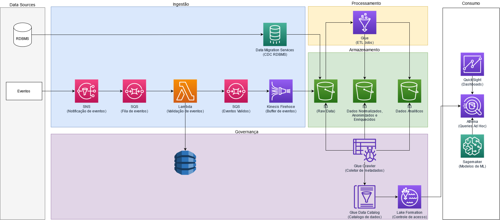

# Arquitetura Proposta

### Ingestão
Abaixo a descrição das soluções de ingestão propostas 

#### Eventos
Apesar de ser possível realizar ingestão de eventos em bucket's S3 de maneiras diferentes,
utilizando Kinesis ou Kafka, foi escolhido manter a solução de ingestão proposta no MVP por não ver
a necessidade de inclusão de peças com custos operacionais maiores.

Sendo assim, a idéia segue a mesma, eventos são enviados para uma fila SQS que é lida por uma função
lambda de validação, essa função lambda consome um repositório de schemas, valida cada evento e posta
eventos válidos em uma fila SQS. Por sua vez, eventos válidos são enviados para um fluxo do kinesis
firehose que entrega pequenos batchs de eventos em um bucket S3.

#### RDBMS
Foi incluida na arquitetura a opção de ingestão de dados a partir de bancos de dados relacionais utilizando
Data Migration Service. Através do Data Migration Service é possível capturar dados de bancos de dados
relacionais utilizando "Change Data Capture", fornecida pela maioria dos SGBD's comerciais.

Através dessa solução, é possível manter dados de diferentes fontes em bucket's S3, possibilitando
cruzamento e enriquecimento de dados.

#### Outras fontes

Poderia ser incluido também outras fontes de dados na arquitetura, a idéia é sempre realizar a ingestão de dados
para bucket's S3 em uma camada primária, no formato bruto. Outros exemplos poderiam ser dados de API's de terceiros,
dados de logs, arquivos de textos, planilhas, etc. Para cada tipo de fonte uma solução de ingestão pode ser criada.

### Armazenamento

A solução proposta utiliza o amazon S3 para armazenamento dos objetos. O Amazon S3 permite o armazenamento de diferentes
tipos de arquivos, é uma solução de armazenamento distribuída e de fácil integração com diferentes ferramentas para consumo.
Armazenando dados no S3, eles podem ser fácilmente consumidos por diferentes ferramentas como Glue, Athena, EMR e Lambda.

A principio a sugestão é de armazenar dados em formato Avro na camada Raw. O Avro é um formato de arquivos que
permite gravação de schemas complexos e permite a evolução de forma simplificada. Além disso, possui boa performance
para gravação.

Já na camada intermediaria e na camada final, a sugestão é o armazenamento de dados em formato Parquet. Por ser
um formato orientado a coluna, trás maior performance na leitura.

Em ambas camadas deve ser levado em consideração o particionamento e a clusterização dos dados. De acordo com o consumo
de cada informação.

### Processamento

Foi proposto a utilização do Glue, para o processamento dos dados. Através do Glue é possivel criar jobs de
ETL em streamming ou em batch. Apesar de ter sido abstraído do desenho, a proposta é de utilizar o Glue
realizando jobs em pequenos Batchs, esses jobs podem ser engatilhados a partir a entrada de dados nos buckets.
Sendo assim, sempre que um novo arquivo for armazenado em um bucket uma função lambda pode disparar um ou mais
jobs do Glue.

Cada Job pode ser desenvolvido conforme a necessidade, utilizando python, pyspark ou scala.

### Governança

Foi proposto a utilização do Glue Data Crawler para coletar informações dos metadados dos objetos armazenados
nos buckets e manter essas informações no Glue Data Catalog.

Uma vez que as informações são armazenadas no Data Catalog elas podem ser utilizadas tanto para criação de jobs
do Glue quanto para consumo através do Athena.

Também foi proposto a utilização do Lake Formation, que facilita a criação de regras de acesso aos dados para diferentes
usuários.

### Consumo

Para o consumo dos dados, existe uma infinidade de possibilidades. No desenho proposto, são apresentadas três ferramentas
para consumo a partir do catalogo de dados

1 - Athena para realizar queries ad-hoc

2 - SageMaker para a criação de modelos de machine learning

3 - QuickSight para criação de dashboards e relatórios

### Considerações finais

Com excessão do Data Migration Service, toda a arquitetura proposta é servless, gerando grande economia em termos
computacionais e operacionais. Mesmo o Data Migration Service minimiza custos operacionais por ser uma infraestrutura
auto gerenciada pela AWS.

Uma arquitetura de um data lake deve ser continuamente evoluída, sempre surgirão novas fontes de dados e necessidades de
disponibilização de dados de formas diferentes. A solução proposta é uma idéia inicial de algo que poderá ser evoluído
continuamente, conforme essas necessidades vão surgindo.
